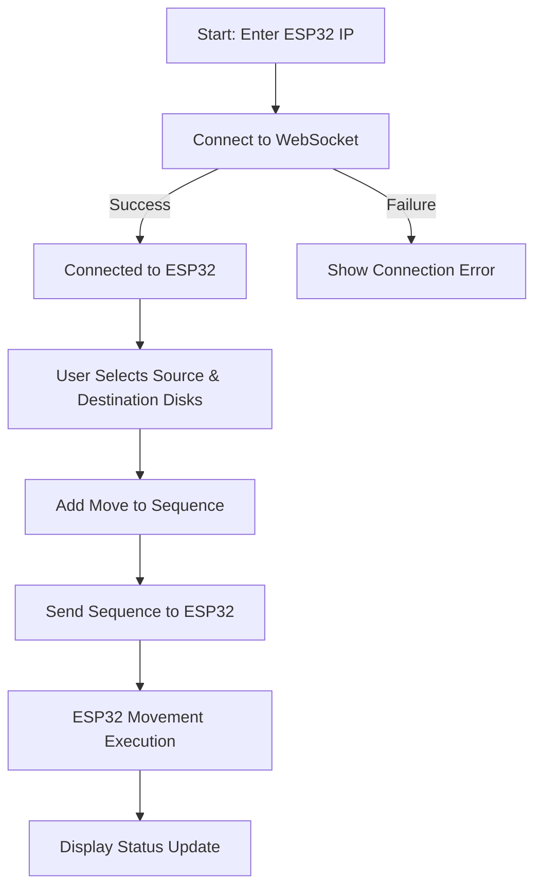

# LAM-research-challenge

# Robotic Disk Manipulator using ESP32

## Overview

This project implements a **multi-axis robotic manipulator system** using an ESP32 to control stepper motors and servo motors for precise disk handling. The system moves colored disks between two towers in response to a user-defined shuffling sequence generated via a PC application, utilizing **WiFi-based WebSocket communication**.

### Problem Statement

The objective is to:

- Assemble a robotic manipulator that can **handle and move disks** between two vertical towers (each with 4 slots).
- Respond to disk **shuffling orders generated by a custom PC application**.
- Use ESP32 as the central microcontroller for motion control and communication.
- Implement **inverse kinematics** for disk placement and gripping via a **mix of stepper motors and servos**.

> The team with the most **accurate and fastest replication** of the shuffling sequence wins. Marks will be deducted if a terminal-based application is used instead of a proper UI.

---

## Features

- **WebSocket Communication** with ESP32
- Real-time Control via PC GUI
- Inverse Kinematics for Arm Positioning
- Stepper Motors for Base and Shoulder Movement
- Servo Control via UART and I2C (MG995 & SC15)
- Load Cell Integration for Force Feedback (Optional)
- Bare-metal code without Arduino framework overhead

---

## System Architecture

### Software Logic (PC → ESP32)



### ESP32 Functional Layout

```
PC APPLICATION
    |
    v
SOFTWARE LOGIC (ESP32)
[WiFi Connection] --> [WebSocket Handler] --> [IK Calculations] --> [Movement Execution]
                                                          |
                                                          v
        ----------------------------------------------------------
       |  I2C - PCA9685 - PWM - SERVO                         |
       |  UART - SC15 SERVO                                  |
       |  GPIO - Stepper Motors (Base, Shoulder)             |
       |  GPIO - Load Cell (optional)                        |
        ----------------------------------------------------------
```

---

## Wiring Diagram

The wiring diagram connects:

- ESP32 to motor control shield
- 12V SMPS and 5V DC Adapter for motor power
- Stepper motors to the X/Y axis
- MG995 and SC15 servo motors for gripping
- Load cell and buck converter for feedback and stable voltage

> See `hardware/wiring-diagram.png` for detailed connections.

---

## Inverse Kinematics Logic

The arm calculates the required positions using:

- `atan2()` for base angle
- Law of Cosines for shoulder angle
- Linear mapping for elbow servo position

These are implemented in `calculateIK()` and executed in `executeMovement()` inside the main loop.

---

## Bare-Metal ESP32 Code

The code handles:

- GPIO control of stepper motors
- Serial and I2C communication with servos
- Inverse kinematics calculations
- Basic movement loop between tower A and B

### Key Code Snippet

```cpp
void executeMovement(float x, float y, float z) {
    calculateIK(x, y, z, baseSteps, shoulderSteps, elbowPos);
    digitalWrite(BASE_DIR_PIN, baseSteps > 0 ? HIGH : LOW);
    smoothStep(BASE_STEP_PIN, BASE_DIR_PIN, abs(baseSteps), 500);
    digitalWrite(SHOULDER_DIR_PIN, shoulderSteps > 0 ? HIGH : LOW);
    smoothStep(SHOULDER_STEP_PIN, SHOULDER_DIR_PIN, abs(shoulderSteps), 500);
    moveSerialServo(0x01, elbowPos, 1000);
}
```

> Full code is available in [`src/main.cpp`](./src/main.cpp)

---

## PC Application

- Developed in Python (or JS/C++ depending on team preference)
- GUI allows:
  - Connecting to ESP32 via WebSocket
  - Selecting source/destination disks
  - Sending shuffle sequences
- Displays status updates after each move

---

## Testing Procedure

1. Power the ESP32 and motor controller via adapters.
2. Open the PC app and connect to the ESP32.
3. Send movement commands using the UI.
4. Observe disk movement from source to destination towers.
5. Verify disk placement matches the requested order.

---

## Directory Structure

```
├── /docs               # Flowcharts, diagrams
├── /hardware           # Wiring diagram and components info
├── /src
│   └── main.cpp        # Bare-metal code for ESP32
├── /ui                 # PC application code
├── README.md
```

---

## Components Used

| Component             | Description                    |
| --------------------- | ------------------------------ |
| ESP32                 | Main controller with WiFi      |
| Stepper Motors        | Base and shoulder movement     |
| MG995 Servo           | Mechanical gripping            |
| SC15 Servo            | Elbow articulation             |
| PCA9685               | I2C Servo Driver               |
| Load Cell             | Optional feedback mechanism    |
| 12V SMPS + 5V Adapter | Power supply                   |
| Motor Shield          | Drives multiple stepper motors |

---

## Future Enhancements

- Integrate camera vision for object detection
- Add feedback loop with load cell for adaptive gripping
- Enhance GUI with real-time 3D arm position visualization

---

## License

This project is provided for educational use only. Commercial use is not permitted without written permission.

